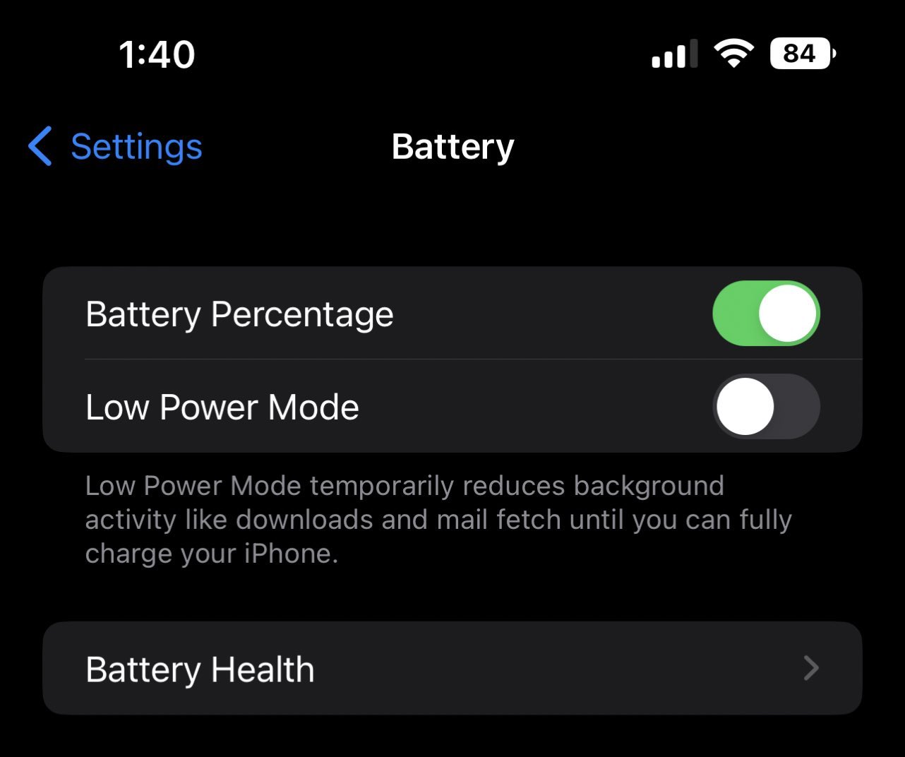

# iOS 16 battery percentage redesign & implementation

iOS 16 allows you to add the battery percentage back to your iPhone, But the cost of showing the numbers is losing the progress bar, it always looks full. 

## Redesign
So I brought the progress bar and colors back into the battery icon to make it look more intuitive.

## Preview

[Codepen](https://codepen.io/jiangmenghao/full/VwXBwWG)

[Github Pages](https://jiangmenghao.github.io/ios-16-battery-percentage/)
